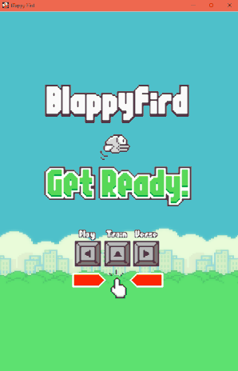

# A-Smart-Blappy-Fird
Description  A Learning Project to familiarize with NEAT, Neural Networks, and Genetic Algorithms

### Prerequisites

1. [Python 3.x.x](https://www.python.org/downloads/)
  
2. [Pygame v1.9.x](http://www.pygame.org/download.shtml)

3. [NEAT v0.92](https://neat-python.readthedocs.io/en/latest/installation.html)

### Installing

1. Clone the Repository

```
$ git clone https://github.com/carminechoi/A-Smart-Blappy-Fird.git
```

or download as zip and extract.

2. In the root directory, run
```
$ pipenv install
$ pipenv run python blappy_fird.py
```

3. Have fun! 


## Demonstration

Option 1: Play

 


Option 2: Train

 


Option 3: Verse

 


## Built With

* [Pycharm](https://www.jetbrains.com/pycharm/)
